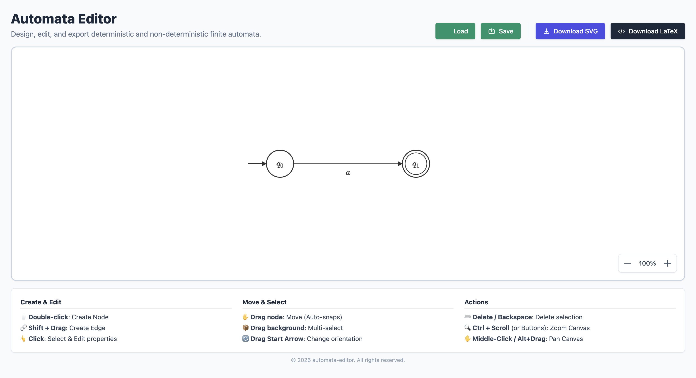

<div align="center">
  
  
  
  <br/>
  <h1>automata-editor</h1>
  <p>
    An interactive, web-based tool for designing, rendering, and exporting finite state automata (DFA/NFA).
  </p>
</div>

---

## 📖 Table of Contents
- [About the Project](#-about-the-project)
- [Key Features](#-key-features)
- [Screenshots](#-screenshots)
- [Local Installation](#-local-installation)
- [Usage Guide](#-usage-guide)
- [Architecture & Tech Stack](#-architecture--tech-stack)
- [Contributing](#-contributing)
- [License](#-license)

---

## 🚀 About the Project

Finite state machines are a staple of computer science, but creating digital, export-ready diagrams for assignments or papers can be tedious. **automata-editor** is a lightweight, zero-dependency browser tool built to solve this problem. It allows users to quickly build automata graphs, render complex mathematical labels using LaTeX syntax, and export their work to SVG or fully formatted native TikZ code.

## ✨ Key Features

- **Interactive Canvas**: Add, move, and connect states with an intuitive drag-and-drop interface.
- **Mathematical Rendering**: Supports LaTeX syntax for state names and transition labels (e.g., `q_0`, `\epsilon`), rendered beautifully in real-time using KaTeX.
- **Smart Routing**: Transition edges automatically determine their routing to prevent visual overlap. Supports multi-graphs, self-loops, and customizable curve offsets.
- **Smart Alignment (Snapping)**: Dragged nodes automatically snap to vertical or horizontal alignment with neighboring nodes.
- **Import / Export functionality**: Save your workspace to a structured JSON format and restore it seamlessly.
- **Export to SVG**: Generate clean, cropped SVG files of your automaton, ready to be embedded.
- **Export to TikZ**: Generate ready-to-compile LaTeX code using the standard `tikz` and `automata` packages.
- **Multi-Selection**: Box-select and drag multiple nodes and edges simultaneously. 

## 📸 Screenshots



## 💻 Local Installation

The project uses Vanilla JavaScript and does not require complex build steps, but a local server is recommended to bypass potential browser CORS issues when loading modules or saving.

1. **Clone the repository:**
   ```bash
   git clone https://github.com/yaronserlin/automata-editor.git
   cd automata-editor
   ```
2. **Start a local web server:**
   ```bash
   # Using Node.js (npx)
   npx serve .
   
   # Or using Python 3
   python3 -m http.server 8000
   ```
3. **Run the app:** Open your web browser and navigate to `http://localhost:3000` (or `http://localhost:8000`).

## 🎯 Usage Guide

1. **Creating Nodes**: **Double-click** the canvas to add a new state.
2. **Creating Edges**: Hold **Shift + Drag** from one state to another to create a transition.
3. **Editing Elements**: Select a node to edit its name, or set it as a 'Start' or 'Accept' state via the properties panel. Select an edge to edit transition symbols.
4. **Moving Elements**: Click and drag nodes to rearrange them. Use the edge drag handle (the label area) to curve transitions.
5. **Camera Controls**:
   - **Pan**: `Alt` + Drag OR Middle Mouse Button + Drag.
   - **Zoom**: `Ctrl` + Scroll OR `Cmd` + Scroll.
6. **Multi-Select**: Click and drag on an empty area of the canvas.
7. **Delete Elements**: Select node(s) or edge(s) and press `Delete` or `Backspace`.

## 🏗 Architecture & Tech Stack

This project deliberately avoids heavy frameworks to remain lightweight and fully understandable.

- **Core Logic**: Modular, Vanilla JavaScript. Files are separated by concern (`globals.js`, `dom.js`, `graph.js`, `events.js`, `render.js`, `export.js`, `utils.js`, `ui.js`, `main.js`).
- **Graphics**: Raw HTML5 `<svg>` manipulation allowing for infinite canvas calculations. 
- **Styling**: Tailwind CSS via CDN for rapid, responsive UI development.
- **Math Typesetting**: KaTeX for performant, offline-ready mathematical symbol parsing.

## 🤝 Contributing

Contributions, issues, and feature requests are welcome!

1. Fork the Project
2. Create your Feature Branch (`git checkout -b feature/AmazingFeature`)
3. Commit your Changes (`git commit -m 'Add some AmazingFeature'`)
4. Push to the Branch (`git push origin feature/AmazingFeature`)
5. Open a Pull Request

## 📄 License

Distributed under the MIT License. See `LICENSE` for more information.
